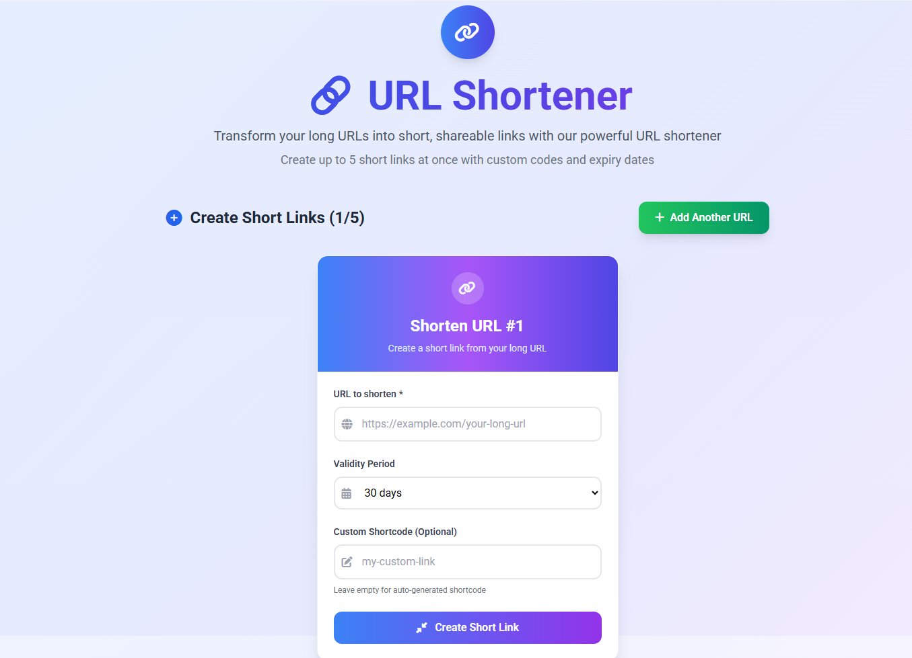
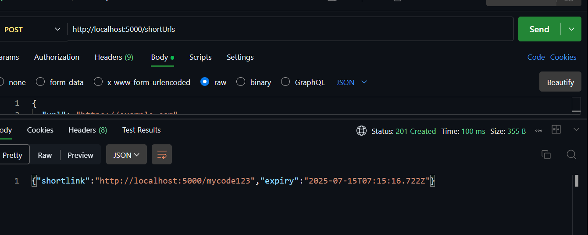
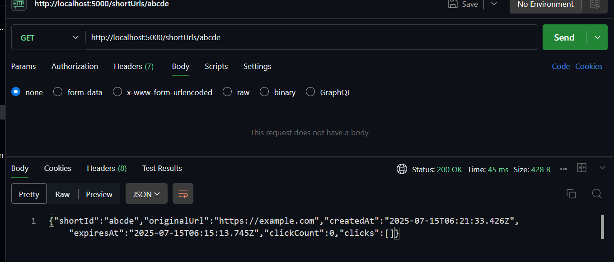

# 🔗 URL Shortener App

A full-stack URL shortener that allows users to shorten long URLs with a custom code and expiration time. Built with **React + Material UI** for frontend, and **Express + MongoDB** for the backend.

---

## ⚙️ Features

- ✂️ Shorten up to 5 URLs concurrently
- 🧠 Client-side validation for inputs
- 🗓️ Set custom validity (in minutes)
- 🎯 Custom short code supported
- 📈 Get statistics like total clicks, click timestamp, browser, and location
- 💅 Material UI-powered responsive design

---

## 🖼️ Screenshots

  

---

## 📁 Folder Structure

project-root/
├── backend/
│ ├── controllers/
│ │ └── urlController.js
│ ├── models/
│ │ └── Url.js
│ ├── routes/
│ │ └── urlRoutes.js
│ └── server.js
│
├── frontend/
│ ├── src/
│ │ ├── components/
│ │ │ ├── UrlInputForm.jsx
│ │ │ └── ResultCard.jsx
│ │ ├── pages/
│ │ │ └── UrlShortenerPage.jsx
│ │ ├── App.jsx
│ │ └── main.jsx
│ └── public/
│ └── index.html
